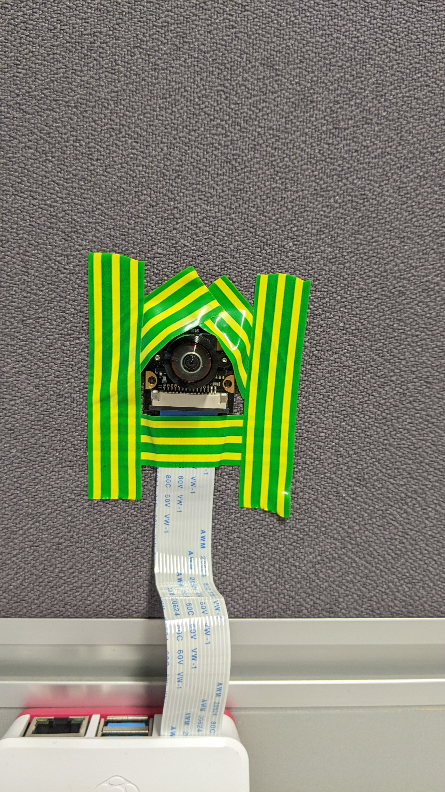

# The objectif
This repository allows differents tools to study the Niryo Ned One. More specificly two raspberry must be used and calibrate in order to detect the position of the arm in the space. This repository is not a final version of the project, it contains research and multiple programs used during an internship in order to answer differents problematics.

# A quick setup

## Tools
Two Raspberry Pi must be installed in order to make the programs work. To do so, they must be place above the 4 marks of Ned One and in there direction. They also must to be placed horizontally, with the cable going down.

<h3 style="color: lime;">To do:</h3>


<h3 style="color: red;">To avoid:</h3>


> [!NOTE]
> The camera doesn't have to be perfectly aligned or horizontal, it can do any angle as long as it isn't to extreme, in wich case the camera will fail to correctly situe itself in space.

When doing a calibration you'll face this window:
```
Mickey's orientation
> 0
  1
  2
  3
```
It is because the camera computes its position in space using the four marks of the Nyrio Ned One. But because those are identical, that means that seeing them from one side or another one is mathematically identical. So, an extra information must be provided. To know the number corresponding, we simply count the side it is facing according this pattern:


<h3>An example of cameras in the position 1:</h3>
<div style="overflow: auto;">
  
  
</div>

<h3>An example of a delicate case in wich the camera is in position 2:</h3>


> [!NOTE]
> When doing the calibration, the result is stored in a json file, allowing it to reuse it few weeks later, of course as long as the setup hasn't been changed.

## How to run
The main program is found in `compute/main.py`. Another python script must be provided in argument. This second program will be run normally, but the first one will parse it and add instruction for the Nyrio Ned One in order to analyse his position.

What `main.py` does:
- when using `ned.move_joints()` or `ned.move_pose()`, add the values of the joints or the pose in `compute/logs/movements.log`
- when using `#calibration theorical_position`, proceed to a detection of the position of the arm, and write the difference with the theorical position in `compute/logs/delta.log`

> [!NOTE]
> The second program can be executed independently while the calibration is written throught comments.

> [!NOTE]
> The `#calibration theorical_position` is formed with `#calibration` wich indicates to the main program to use the cameras, and `theorical_position` which is a variable containing the position we want to compare. It means that this variable can be called differently as long as it is defined before.

> [!IMPORTANT]
> The second script python must be placed in the same folder than the main one.

An example can be found by runing
```
python3 compute/main.py compute/program.py
```

The resulting program (after the parsing) is saved in the main repository in the format `scriptName_proof.py`, allowing verification.

> [!WARNING]
> When using on another computer or context, some lines using absolute path must be changed, especially in `photo.sh` and in `detecte_gree,_square.py`.

# Report

Soon